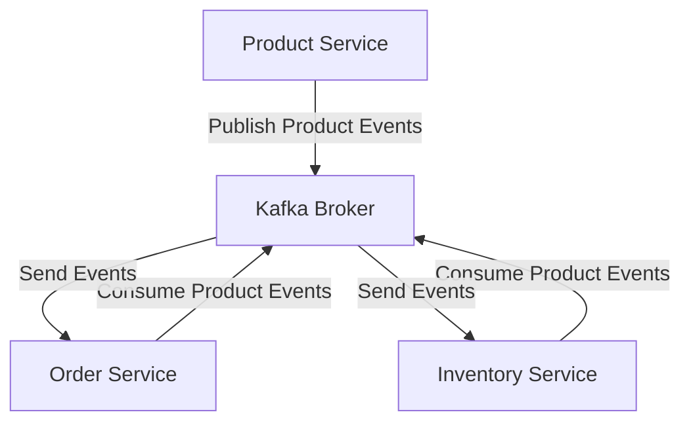

# Distributed Kafka Microservices Demo

[](https://kafka.apache.org/)
[](https://www.java.com/)
[](https://spring.io/projects/spring-boot)

## Table of Contents

- [Project Overview](#project-overview)
- [Project Structure](#project-structure)
- [Architecture Overview](#architecture-overview)
    - [Inter-Service Communication Flow](#inter-service-communication-flow)
    - [Services Breakdown](#services-breakdown)
    - [Technical Stack](#technical-stack)
    - [Kafka Configuration](#kafka-configuration)
    - [Event Flow Example](#event-flow-example)
    - [Error Handling Strategies](#error-handling-strategies)
    - [Contributing](#contributing)
    - [Future Improvements](#future-improvements)

## Project Overview

This project demonstrates a distributed microservices architecture using Apache Kafka for event-driven communication. It
showcases real-time processing, loose coupling, and asynchronous messaging among services.

## Project Structure

```markdown
kafka-demo/
│
├── producer/
│ ├── src/ # Producer service source code
│ ├── resources/ # Producer-specific configs
│ └── ...
├── consumer/
│ ├── src/ # Consumer service source code
│ ├── resources/ # Consumer-specific configs
│ └── ...
├── README.md # Documentation
└── .idea/ # IDE configuration files
```

## Architecture Overview

The application uses Apache Kafka as a central message broker for inter-service communication, enabling a robust,
event-driven microservices architecture.

### Inter-Service Communication Flow



## Services Breakdown

### 1. Product Service

- Manages product creation and updates
- Publishes product-related events to Kafka
- Provides product-related APIs

### 2. Order Service

- Handles order creation and lifecycle management
- Consumes product and inventory events from Kafka
- Publishes order-related events

### 3. Inventory Service

- Tracks inventory levels for products
- Consumes product events and updates stock
- Ensures inventory consistency across systems

## Technical Stack

### Core Technologies

- **Language**: Java 17
- **Framework**: Spring Boot
- **Messaging**: Apache Kafka
- **Serialization**: JSON
- **Dependency Management**: Maven/Gradle

### Key Libraries

- Spring Kafka
- Jackson JSON
- Lombok
- Slf4j Logging

## Kafka Configuration

```properties
# Kafka Connection
spring.kafka.bootstrap-servers=localhost:9092
spring.kafka.consumer.group-id=microservices-consumer-group
# Topics
kafka.topics.product=product-topic
kafka.topics.order=order-topic
kafka.topics.inventory=inventory-topic
```

## Event Flow Example

1. Product Service publishes a product creation/update event to Kafka
2. Kafka Broker distributes the event to subscribed topics
3. Order Service and Inventory Service consume the event
4. Services update their respective domains

## Error Handling Strategies

- Retry Mechanisms for failed messages
- Dead Letter Queues for unprocessed events
- Comprehensive Logging
- Graceful Degradation under partial system failure

## Contributing

1. Set up local Kafka environment
2. Implement service-specific logic
3. Add comprehensive tests
4. Optimize performance and scalability

## Future Improvements

- Schema validation using Avro/Protobuf
- Advanced monitoring with Prometheus and Grafana
- Expand microservices with more domain-specific services

---

**Feel free to explore, run the services, and experiment with Kafka-driven microservices!**